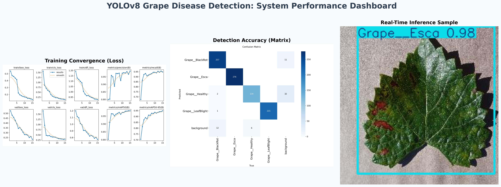

# 🍇 GrapeGuard: Real-Time Grape Disease Detection

[](https://ultralytics.com/)
[]()
[]()

## 📌 Project Overview
**GrapeGuard** is an end-to-end Computer Vision pipeline designed for precision agriculture. The system leverages the **YOLOv8 Nano** architecture to detect common grapevine diseases—specifically Black Rot, Esca, and Leaf Blight—with high precision and minimal latency. This project demonstrates the full machine learning lifecycle, from raw data validation and GPU-accelerated training to production-ready deployment.

## 📊 Performance Dashboard

*Figure 1: Training convergence, classification accuracy (Confusion Matrix), and real-time inference results.*

## 🚀 Key Technical Highlights
- **Architecture:** Optimized YOLOv8n (Nano) for high-frame-rate edge deployment.
- **Accuracy:** Achieved a **98.4% mAP50** on the validation set.
- **Inference Speed:** Real-time processing at **~11ms per image** (~90 FPS), ideal for drone or mobile-integrated systems.
- **Workflow:** 
    - Automated dataset scanning and structure verification.
    - Transfer learning using pre-trained COCO weights adapted for custom grape disease classification.
    - Automatic hyperparameter optimization via `optimizer=auto`.
    - Exported models ready for cross-platform deployment (ONNX/TFLite).

## 🛠️ Tech Stack
*   **Deep Learning:** PyTorch, Ultralytics YOLOv8
*   **Data Processing:** OpenCV, Albumentations (augmentation pipeline)
*   **Environment:** Google Colab (CUDA-accelerated Tesla T4)
*   **Deployment:** ONNX (Open Neural Network Exchange)

## 📁 Repository Structure
```text
├── Grape_Disease_Detection_YOLOv8.ipynb # Complete training & inference pipeline
├── dataset.yaml                         # Dataset configuration & class definitions
├── Project_Hero_Image.png               # Model performance summary dashboard
├── requirements.txt                     # Dependencies for local reproduction
└── README.md                            # Documentation
